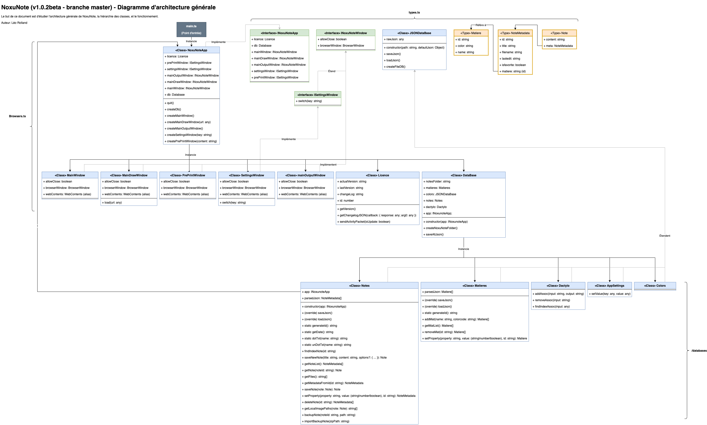

<p align="center">
  <br><br>
  
  
  
</p>

#  NoxuNote

NoxuNote est une application de note pour étudiants et professionnels fonctionnant sur Windows, Mac, et Linux. Elle intègre les fonctionnalités de base d'un traiteur de texte, en proposant des outils innovants pour faire exploser votre productivité.

## Fonctionnalités

- Noter ses cours plus vite en devinant les mots compliqués
- Tri par matières (UE), enregistrement, et gestion des notes integré.
- Insertion de formules mathématiques en langage humain et intuitif.
- Créer des dessins, courbes de fonction, schémas, modifiez des images.
- Calepin integré qui vous suit toute la journée
- Créer des tableaux facilement
- Convertisseur d'unités, dérivateur, calculatrice
- Glisser-déposé de contenu d'internet vers NoxuNote
- Import, export, partage et gestion des notes simplifiée
- Export en PDF avec beaucoup d'options de personnalisation
- Économiser de la batterie en diminuant les pixels blancs à l'écran

## Installation

Rendez vous sur le site, [noxunote.fr](https://www.noxunote.fr) pour télécharger l'installeur du projet.

# Développement

## Compiler et lancer
1) Installez **NodeJS** et **git**
2) Clonez le projet : `git clone https://github.com/leorolland/NoxuNote`
3) Naviguez dans le dossier crée : `cd NoxuNote`
4) Ouvrez un terminal, et installez TypeScript : `npm i -g typescript` 
5) Installez les dépendances du projet : `npm install` ou `npm i` (alias)
6) Compilez et lancez NoxuNote : `npm start` ou `npm run start` (alias)

## Contribuer
Description de la structure des fichiers : (Les éléments importants sont mis en gras)

### Architecture de fichiers
- **/app** - La source de l'application
  - components - Quelques composants dynamiques individuels
    - ConfirmationPrompt.ts - Pop-up de confirmation
    - StringPrompt.ts - Pop-up d'entrée de texte
  - **databases** - Stockage des préférences et des notes
    - AppSettings.ts - Base de données relative au réglages de l'app
    - Colors.ts - BDD relative aux couleurs
    - Dactylo.ts - BDD relative aux raccourcis de mots
    - Matieres.ts - BDD relative aux matières
    - **Notes.ts** - BDD relative aux notes 
  - fonts - Polices de caractère
  - images - Images
  - **views** - Contient les fenêtres de NoxuNote
    - mainDrawWindow - Fenêtre de dessin
    - **mainWindow** - Fenêtre principale de NoxuNote
      - plugins 
        - browse.ts - Navigateur de notes
        - calc.ts - Calculatrice
        - info.ts - Volet transparent d'informations
        - todo.ts - Bloc notes "à faire"
      - **index.html** - Structure de la fenêtre principale de NoxuNote
      - **mainWindow.ts** - Script principal de la fenêtre principale
      - ...
    - outputWindow - Fenêtre qui génère le pdf
    - prePrintWindow - Fenêtre de réglages avant impression
    - settingsWindow - Fe,être des réglages
  - **Browsers.ts** - Classe principale de l'application (NoxuNoteApp)
  - DataBase.ts - Classe qui instancie les ./databases comme Notes.ts
  - Licence.ts - Gère les versions, paquets d'activité, etc.
  - main.ts - Point de départ et point central de l'IPC (IPCMain)
  - parser.ts - Gère les anciennes versions de NoxuNote pour la conversion
  - types.ts - Définit les types

## Architecture des classes
Pour comprendre l'architecture des classes, vous pouvez utiliser ce document, partant du point d'entrée de l'application "main.ts"
[](./doc/arch.png)

## Tests

### Tests unitaires
- Aucun test unitaire n'est implémenté actuellement. C'est à prévoir dans les prochaines versions.

### Assertions
- Essayez d'utiliser la librairie **assert** de NodeJS pour vérifier que les paramètres d'entrée de vos fonctions sont corrects, et ainsi éviter des bugs (element undefined, element null ..).

### Compter les Listeners dans la page
- Vous pouvez vérifier que la page ne se surcharge pas en EventListeners au fil du temps en utilisant recopiant le code suivant dans la console de déboguage, il vous retournera un objet décrivant le nombre de listeners de chaque type dans votre document.

```javascript
  Array.from(document.querySelectorAll('*'))
  .reduce(function(pre, dom){
    var evtObj = getEventListeners(dom)
    Object.keys(evtObj).forEach(function (evt) {
      if (typeof pre[evt] === 'undefined') {
        pre[evt] = 0
      }
      pre[evt] += evtObj[evt].length
    })
    return pre
  }, {})

  /* output :
  {
    blur: 9
    change: 2
    click: 163
    dragenter: 1
    dragleave: 1
    dragover: 1
    drop: 1
    error: 1
  }
  /*
```
